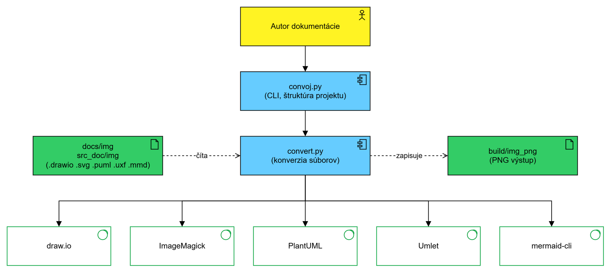

# convoj

Nástroj na jednoduchú konverziu diagramov do PNG. Zdrojové formáty: **SVG, draw.io, PlantUML, UMLet, Mermaid** (a SVG exporty z Archi).

Jedným príkazom skonvertuje všetky obrázky v adresári (vrátane podadresárov), alebo len konkrétny súbor (`-f`).

## Ako to funguje

Convoj sa skladá z dvoch python skriptov:

- **`src/convoj.py`** — obslužný program. 
    - Spracuje argumenty z príkazového riadku a nájde koreň projektu podľa adresárovej štruktúry, ktorú používam na projektoch (hľadá smerom nahor markery `.git`, `build`, `docs`, `src_doc`). 
    - Obrázky berie z `docs/img/` alebo `src_doc/img/`, výstup ukladá do `build/img_png/` so zachovaním štruktúry podadresárov.
- **`src/convert.py`** — samotná konverzia. Prejde stromom zdrojov a pre každý súbor zavolá externý nástroj.

Convoj teda sám nič nekreslí — iba prevoláva externé nástroje:

| Formát | Prípona | Nástroj | Cesta |
|---|---|---|---|
| draw.io | `.drawio` | draw.io CLI | `.drawio` → `.png` |
| SVG (aj Archi export) | `.svg` | ImageMagick (`magick`) | `.svg` → `.png` |
| PlantUML | `.puml` | plantuml.jar (java) | `.puml` → `.svg` → `.png` |
| UMLet | `.uxf` | Umlet | `.uxf` → `.svg` → `.png` |
| Mermaid | `.mmd` | mermaid-cli (`mmdc`) | `.mmd` → `.png` |

## Použitie

```bash
./convoj_docker.sh all                  # skonvertuj všetko (v Dockeri)
./convoj_docker.sh drawio               # len drawio súbory
./convoj_docker.sh clean                # zmaž build/ (generované súbory)
./convoj_docker.sh all -f Business/ciel # len konkrétny súbor / adresár
./convoj_docker.sh all -s 4             # väčšia mierka (postery)
```

Príkazy: `all`, `clean`, `svg`, `drawio`, `plantuml`, `umlet`, `mermaid`, `archi`.
Prepínače: `-f` (len daný súbor/adresár), `-s` (mierka, default 2.0), `-l` (loglevel), `-g` (log do súboru).

Wrappery: `convoj_docker.sh` (Linux/WSL, spúšťa Docker kontajner), `convoj_linux.sh` (Linux/WSL natívne — nástroje musia byť nainštalované lokálne), `convoj.bat` (Windows natívne, s `CONVOJ_DOCKER=1` cez Docker).

## Docker

Image obsahuje python skripty, ImageMagick a drawio (PlantUML, UMLet a Mermaid zatiaľ nie).

```bash
# build (raz, v adresári convoj)
docker build -t convoj .

# spustenie — wrapper namountuje projekt a spustí kontajner
cd ~/moj-projekt
~/convoj/convoj_docker.sh all                 # Linux/WSL
set CONVOJ_DOCKER=1 && convoj all             # Windows (spúšťať z koreňa projektu)

# alebo priamo bez wrappera
docker run --rm --user $(id -u):$(id -g) -v "$PWD:/work" convoj all
```

Ako to funguje: drawio je Electron aplikácia, v kontajneri beží headless cez `xvfb-run` (wrapper `docker/drawio-wrapper.sh`). Projekt sa mountuje ako `/work`, výstupy pribudnú v `build/img_png/` na disku. Iný image nastavíš cez `CONVOJ_IMAGE`.

Aby sa `convoj` dal volať odkiaľkoľvek (WSL/Linux):

```bash
mkdir -p ~/.local/bin
ln -s /mnt/c/Projects_src/vojto_tools/convoj/convoj_docker.sh ~/.local/bin/convoj
# alebo alias: echo "alias convoj='.../convoj_docker.sh'" >> ~/.bashrc
```

Cesty k nástrojom sa dajú prebiť env premennými (inak default podľa OS): `CONVOJ_DRAWIO_CMD`, `CONVOJ_MAGICK_CMD`, `CONVOJ_UMLET_CMD`, `CONVOJ_MMDC_CMD`, `CONVOJ_PLANTUML_JAR`.

## Koncept



Zdrojový diagram je v `docs/img/convoj_concept.drawio`

## Obmedzenia / TODO

- Docker image zatiaľ nepokrýva PlantUML, UMLet a Mermaid — tie fungujú len natívne (Windows).
