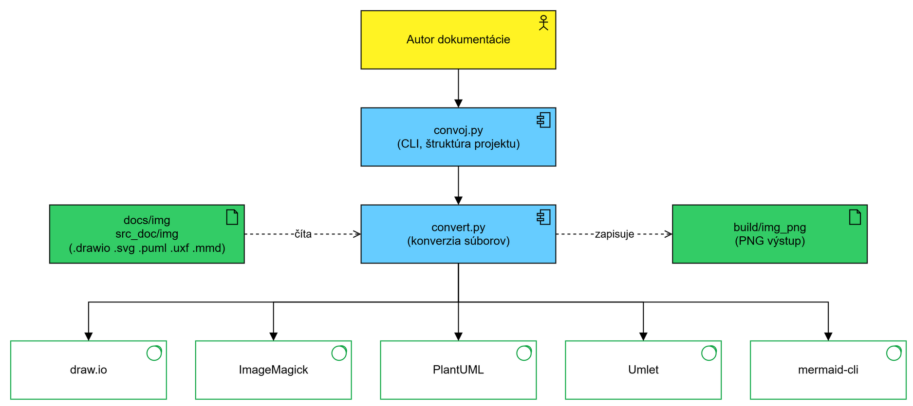

# convoj

Nástroj na jednoduchú konverziu diagramov do PNG. Zdrojové formáty: **SVG, draw.io, PlantUML, UMLet, Mermaid** (a SVG exporty z Archi).

Jedným príkazom skonvertuje všetky obrázky v adresári (vrátane podadresárov), alebo len konkrétny súbor (`-f`).

Konverzia je inkrementálna — súbor sa konvertuje len ak výstup ešte neexistuje, alebo ak je zdroj novší ako výstup. Prekonvertovanie všetkého sa dá vynútiť prepínačom `-F`.

## Setup

### Docker

Ako prvy potrebujem zbuildovat image a dať ho do dockera, odkiaľ sa bude spúšťať.

Image obsahuje python skripty, ImageMagick a drawio (PlantUML, UMLet a Mermaid zatiaľ nie).

```bash
# build (raz, v adresári convoj)
docker build -t convoj .
```

### Nastavenie prostredia

Aby som vedel ľahko spúšťať convoj odkiaľkoľvek, treba do `~/.local/bin` pridať linku na script

```bash
mkdir -p ~/.local/bin
ln -s /home/vojto/Projects/convoj/convoj_docker.sh ~/.local/bin/convoj
```

```bash
# ln -s /mnt/c/Projects_src/vojto_tools/convoj/convoj_docker.sh ~/.local/bin/convoj   # WSL, ak beží z Windows disku
```

`~/.local/bin` musí byť v PATH. Overenie:

```bash
echo $PATH | tr ':' '\n' | grep "$HOME/.local/bin"
```

Ak nie, treba na koniec `~/.profile` pridať riadok

```bash
export PATH="$HOME/.local/bin:$PATH"
```

Overenie, že linka funguje:

```bash
type convoj        # má vypísať: convoj is /home/vojto/.local/bin/convoj
```

## Použitie

```bash
convoj -imgdir build/logo -imgdestdir build/img_png/logo svg   # vstupne svg hlada v build/logo a výstup ukladá do build/img_png/logo
```

Prepínače: 
  `-f` (len daný súbor/adresár),  
  `-F` (vynúť konverziu aj keď je výstup aktuálny),  
  `-s` (mierka, default 2.0),  
  `-l` (loglevel),  
  `-g` (log do súboru).

Príkazy: `all`, `clean`, `svg`, `drawio`, `plantuml`, `umlet`, `mermaid`, `archi`, `copy` (hotové `.png`/`.webp`/`.ico` sa nekonvertujú, len skopírujú do `img_png`).


## Ako to funguje

### Python

Convoj sa skladá z dvoch python skriptov:

- **`src/convoj.py`** — obslužný program. 
    - Spracuje argumenty z príkazového riadku a nájde koreň projektu podľa adresárovej štruktúry, ktorú používam na projektoch (hľadá smerom nahor markery `.git`, `build`, `docs`, `src_doc`). 
    - Obrázky berie z `docs/img/` alebo `src_doc/img/`, výstup ukladá do `build/img_png/` so zachovaním štruktúry podadresárov.
- **`src/convert.py`** — samotná konverzia. Prejde stromom zdrojov a pre každý súbor zavolá externý nástroj.

Convoj teda sám nič nekreslí — iba prevoláva externé nástroje:

| Formát | Prípona | Nástroj | Cesta |
|---|---|---|---|
| draw.io | `.drawio` | draw.io CLI | `.drawio` → `.png` |
| SVG (aj Archi export) | `.svg` | ImageMagick (`magick`) | `.svg` → `.png` |
| PlantUML | `.puml` | plantuml.jar (java) | `.puml` → `.svg` → `.png` |
| UMLet | `.uxf` | Umlet | `.uxf` → `.svg` → `.png` |
| Mermaid | `.mmd` | mermaid-cli (`mmdc`) | `.mmd` → `.png` |


### Docker

`convoj` smeruje na `/home/vojto/Projects/convoj/convoj_docker.sh`. Toto je wrapper namountuje projekt a spustí kontajner. 

Bez wrappera by to bolo:

```bash
# alebo priamo bez wrappera
docker run --rm --user $(id -u):$(id -g) -v "$PWD:/work" convoj all
```

Ako to funguje: drawio je Electron aplikácia, v kontajneri beží headless cez `xvfb-run` (wrapper `docker/drawio-wrapper.sh`). Projekt sa mountuje ako `/work`, výstupy pribudnú v `build/img_png/` na disku. 

Iný image nastavíš cez `CONVOJ_IMAGE`. Cesty k nástrojom sa dajú prebiť env premennými (inak default podľa OS): `CONVOJ_DRAWIO_CMD`, `CONVOJ_MAGICK_CMD`, `CONVOJ_UMLET_CMD`, `CONVOJ_MMDC_CMD`, `CONVOJ_PLANTUML_JAR`.

Wrappery: `convoj_docker.sh` (Linux/WSL, spúšťa Docker kontajner), `convoj_linux.sh` (Linux/WSL natívne — nástroje musia byť nainštalované lokálne), `convoj.bat` (Windows natívne, s `CONVOJ_DOCKER=1` cez Docker).

### Koncept



Zdrojový diagram je v `docs/img/convoj_concept.drawio`

## Obmedzenia / TODO

- Docker image zatiaľ nepokrýva PlantUML, UMLet a Mermaid — tie fungujú len natívne (Windows).
